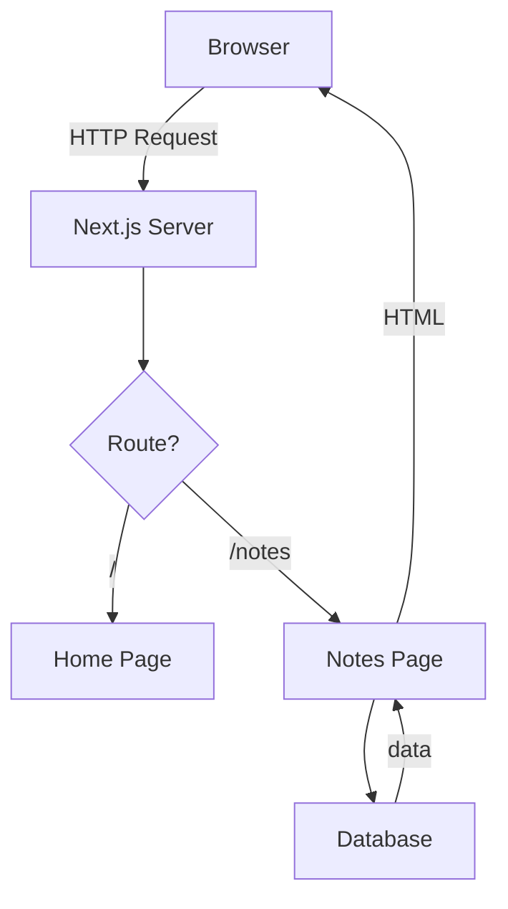
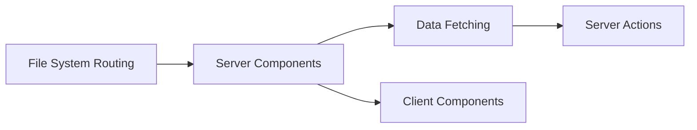

# Visual Learning Techniques

## Why Visual?

Humans process visuals 60,000x faster than text. For a speed learning mode, diagrams are not optional — they are the primary teaching tool.

## Diagram Selection Guide

| What you're explaining | Best visual | Example |
|------------------------|------------|---------|
| System architecture | Flowchart (TD) | How Next.js processes a request |
| File → URL mapping | Table | `app/notes/page.tsx` → `/notes` |
| Concept dependencies | Flowchart (LR) | "Learn A before B" |
| Request/response flow | Sequence diagram | Client → Server → Database |
| State changes | State diagram | Loading → Success/Error |
| Code execution order | Numbered list + arrows | Step 1 → Step 2 → Step 3 |
| Comparison | Table | Server Component vs Client Component |

## Mermaid Templates

### Architecture Overview


### Concept Dependency Graph


### Comparison Table
```
| Feature | Server Component | Client Component |
|---------|-----------------|-----------------|
| Default | ✅ Yes | ❌ Need 'use client' |
| Runs on | Server | Browser |
| Can use useState | ❌ | ✅ |
| Can fetch data | ✅ async/await | ❌ (use useEffect) |
| JS shipped to browser | ❌ No | ✅ Yes |
```

## Rules

1. Every diagram must have a title/caption
2. Every diagram must be preceded by a one-sentence explanation of what it shows
3. Complex diagrams should be broken into multiple simpler ones
4. Always use Mermaid (renders in GitHub, VS Code, most markdown viewers)
